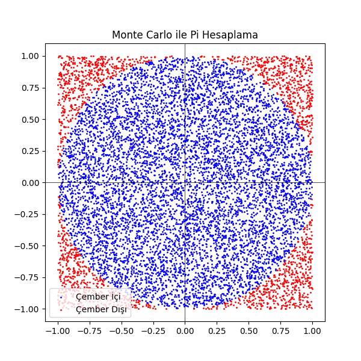

# Monte Carlo ile Pi Sayısını Hesaplama 🚀

Bu proje, **Monte Carlo yöntemini** kullanarak Pi sayısını yaklaşık olarak hesaplamaktadır. Yöntem, rastgele üretilen noktaların bir çember ve kare içinde nasıl dağıldığını analiz eder. Ayrıca görselleştirme ve hata analizi gibi ek özelliklerle daha kapsamlı bir inceleme sunar.

---

## 🔍 Proje Hakkında

Monte Carlo yöntemi, olasılık ve rastgelelik temelli bir hesaplama yaklaşımıdır. Bu projede:
- Bir birim kare içinde rastgele noktalar üretilir.
- Çemberin içine düşen noktalar sayılarak Pi’nin yaklaşık değeri hesaplanır.
- Matplotlib kullanılarak sonuçlar görselleştirilir.

---

## 🎯 Amaçlar
- **Matematiksel Hesaplama**: Pi’nin yaklaşık değerini hesaplamak.
- **Görselleştirme**: Çember içindeki ve dışındaki noktaları grafikte göstermek.
- **Performans Analizi**: Nokta sayısına göre hesaplama hatası ve sürelerini analiz etmek.

---

## 📂 Proje İçeriği
- **`MonteCarloPi.ipynb`**: Proje kodlarını içeren Jupyter Notebook dosyası.
- **`circle_simulation.png`**: Çember simülasyonu çıktısının görseli.
- **`README.md`**: Proje hakkında detaylı açıklamaları içeren bu dosya.
- **`LICENSE`**: Projenin lisans bilgileri.

---

## 🛠️ Kullanılan Teknolojiler
- **Python 3.9+**
- **NumPy**: Rastgele sayı üretimi ve matematiksel hesaplamalar.
- **Matplotlib**: Verilerin görselleştirilmesi.

---

## 💻 Kurulum ve Çalıştırma

### Gerekli Kütüphaneler
Projeyi çalıştırmadan önce aşağıdaki kütüphaneleri yükleyin:
```bash
pip install numpy matplotlib
```
Projeyi Çalıştırma
Bu projeyi bilgisayarınıza klonlayın:
```bash
git clone https://github.com/iamemirhancakir/MonteCarloPi.git
cd MonteCarloPi
```
Jupyter Notebook veya bir Python IDE ile dosyayı açın.
Çalıştırın ve sonuçları gözlemleyin!

## 📊 Örnek Çıktılar
- Simülasyon Grafiği
Aşağıdaki grafik, çember içinde ve dışında kalan noktaları göstermektedir:


- Örnek Pi Hesabı
Rastgele 10,000 nokta ile Pi’nin yaklaşık değeri:
```bash
Monte Carlo ile Hesaplanan Pi: 3.1412
```

## 📈 Geliştirme Fikirleri
Bu projeyi daha da geliştirmek için:

- Farklı nokta sayılarında hata oranlarını analiz edin.
- 3D bir simülasyon oluşturarak bir küre ve küp üzerinde çalışın.
- Çoklu işlemciler kullanarak performansı artırın.
- Kullanıcıların girdilerini alarak dinamik bir simülasyon hazırlayın.

## 🤝 Katkıda Bulunun
Eğer projeyi geliştirmek isterseniz, katkılarınızı bekliyoruz:

- Fork yapın.
- Yeni bir dal (branch) oluşturun: git checkout -b feature-isim
- Değişikliklerinizi gönderin: git commit -m "Yeni özellik eklendi"
- Dalınızı gönderin: git push origin feature-isim
- Bir Pull Request açın.

## 📝 Lisans
Bu proje MIT Lisansı ile lisanslanmıştır.

## 📧 İletişim
Herhangi bir sorunuz veya öneriniz varsa benimle iletişime geçmekten çekinmeyin:

GitHub: iamemirhancakir
E-posta: emirhancakir003@gmail.com

